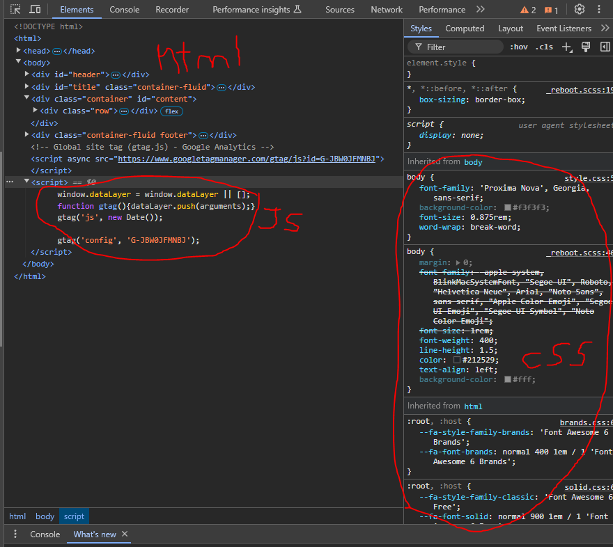

What database?

   https://obis.org/ Obis is an open-access marine biodiversity database

What web technologies?
   -HTML
   -CSS
   -JavaScript
   I've gathered this by looking through some of the code using the inspect feature. I don't believe there are any other technologies/languages, but I could be missing something.
   

Who built this website? How many people were involved? How can you tell?

   Well, I've browsed through the about page and I've come up with some useful information. OBIS is connected to 500 institutions from 56 different countries, so in terms of the data recieved, there are many many many contributors. I can only imagine at each of these institutions there are dozens of people that help with the project. Not 100% sure who made the website in terms of the coding aspect. From what I found online, the "Public Interest Registry" sponsors .org domains. While a provider called "Donuts" actually creates the website. OBIS runs on a .org domain, so this might be the answer. 